# Assignment 1: Quarto template


## Instructions: Please read through this before you begin

- This assignment is due by **10pm on Thursday 09/04/2025** <br>
- For this assignment, please **reproduce this markdown file exactly as
  shown** using Quarto (including this list of instructions). You do
  **NOT** need to fill out the code chunks (i.e. answer the questions)
  for this assignment. We are just practicing markdown formatting right
  now.
- Please name your Quarto file `assignment_1.qmd`
- Set the output format to gfm to produce the correct `.md` file for
  GitHub rendering.
- Pay attention to all the formatting in this file, including bullet
  points, bold characters, inserted code chunks, headings, text colors,
  blank lines, and etc. You will need to reproduce all of these.
- You will use the product of this assignment as a template for your
  fourth assignment, where you actually fill out the code chunks.
- You will have to submit your assignment through GitHub. You can
  complete your template after Thursday’s class, but don’t worry about
  submitting it until after we have gone over how to submit it through
  GitHub in next Tuesday’s class. To do so, you will first move
  `assignment_1.qmd` and `assignment_1.md` to the `problem_sets` folder
  in your own GitHub Classroom. (If you haven’t created this repo yet,
  please use the following url:
  https://classroom.github.com/a/StaRJQLV). Then, you can stage these
  files, make a commit, and push the commit.

## Load packages

To start, load all the required packages with the following code.
Install them if they are not installed yet.

``` r

```{.r .cell-code}
library(tidyverse)
```

    ── Attaching core tidyverse packages ──────────────────────── tidyverse 2.0.0 ──
    ✔ dplyr     1.1.4     ✔ readr     2.1.5
    ✔ forcats   1.0.0     ✔ stringr   1.5.2
    ✔ ggplot2   4.0.0     ✔ tibble    3.3.0
    ✔ lubridate 1.9.4     ✔ tidyr     1.3.1
    ✔ purrr     1.1.0     
    ── Conflicts ────────────────────────────────────────── tidyverse_conflicts() ──
    ✖ dplyr::filter() masks stats::filter()
    ✖ dplyr::lag()    masks stats::lag()
    ℹ Use the conflicted package (<http://conflicted.r-lib.org/>) to force all conflicts to become errors

``` r
library(knitr)
```

## Exercise 1. Corruption and human development

This exercise explores a dataset containing the human development index
(`HDI`) and corruption perception index (`CPI`) of 173 countries across
6 different regions around the world: Americas, Asia Pacific, Eastern
Europe and Central Asia (`East EU Cemt`), Western Europe
(`EU W. Europe`), Middle East and North Africa and Noth Africa (`MENA`),
and Sub-Saharan Africa (`SSA`). (Note: the larger CPI is, the less
corrupted the country is perceived to be.)

First, we load the data using the following code.

``` r

```{.r .cell-code}
economist_data <- read_csv("https://raw.githubusercontent.com/nt246/NTRES-6100-data-science/master/datasets/EconomistData.csv")
```

    New names:
    Rows: 173 Columns: 6
    ── Column specification
    ──────────────────────────────────────────────────────── Delimiter: "," chr
    (2): Country, Region dbl (4): ...1, HDI.Rank, HDI, CPI
    ℹ Use `spec()` to retrieve the full column specification for this data. ℹ
    Specify the column types or set `show_col_types = FALSE` to quiet this message.
    • `` -> `...1`

#### 1.1 Show the first few rows of `economist_data`.

``` r

```{.r .cell-code}
options(warn = -1)

head(economist_data) %>% kable()
```

|  …1 | Country     | HDI.Rank |   HDI | CPI | Region            |
|----:|:------------|---------:|------:|----:|:------------------|
|   1 | Afghanistan |      172 | 0.398 | 1.5 | Asia Pacific      |
|   2 | Albania     |       70 | 0.739 | 3.1 | East EU Cemt Asia |
|   3 | Algeria     |       96 | 0.698 | 2.9 | MENA              |
|   4 | Angola      |      148 | 0.486 | 2.0 | SSA               |
|   5 | Argentina   |       45 | 0.797 | 3.0 | Americas          |
|   6 | Armenia     |       86 | 0.716 | 2.6 | East EU Cemt Asia |

#### 1.2 Expore the relationship between human development index (`HDI`) and corruption perception index (`CPI`) with a scatter plot as the following.

``` r

::: {.cell}

```{.r .cell-code}
library(ggplot2)

library(ggplot2)

ggplot(economist_data, aes(x = CPI, y = HDI)) +
  geom_point(color = "black", size = 1) +
  labs(
    x = "CPI",
    y = "HDI"
  ) +
  theme_gray()
```

<div class="cell-output-display">

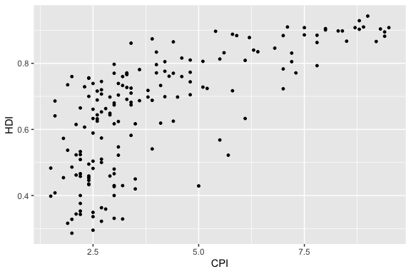

</div>

:::

#### 1.3 Make the color of all points in the previous plot red.

``` r

::: {.cell}

```{.r .cell-code}
library(ggplot2)

ggplot(economist_data, aes(x = CPI, y = HDI)) +
  geom_point(color = "red", size = 1) +
  labs(
    x = "CPI",
    y = "HDI"
  ) +
  theme_gray()
```

<div class="cell-output-display">

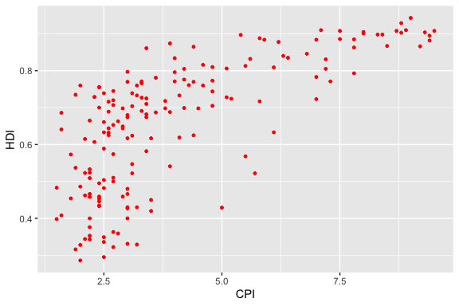

</div>

:::

#### 1.4 Color the points in the previous plot according to the `Region` variable, and set the size of points to 2.

``` r

::: {.cell}

```{.r .cell-code}
library(ggplot2)
 
ggplot(economist_data, aes(x = CPI, y = HDI, color = Region)) +
  geom_point(size = 2) +
  labs(
    x = "CPI",
    y = "HDI"
  ) +
  theme_gray()
```

<div class="cell-output-display">

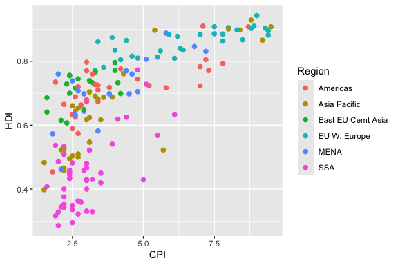

</div>

:::

#### 1.5 Set the size of the points proportional to `HDI.Rank`

``` r

::: {.cell}

```{.r .cell-code}
library(ggplot2)
 
ggplot(economist_data, aes(x = CPI, y = HDI, color = Region, size = HDI.Rank)) +
  geom_point() +
  labs(
    x = "CPI",
    y = "HDI"
  ) +
  theme_gray()
```

<div class="cell-output-display">

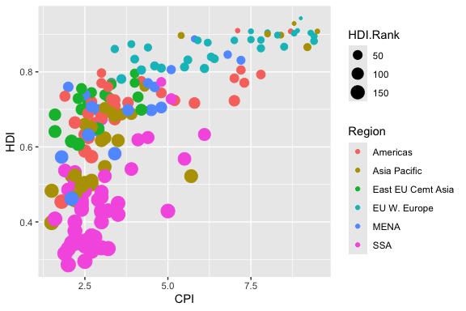

</div>

:::

#### 1.6 Fit a smoothing line to all the data points in the scatter plot from Excercise 1.4

``` r

::: {.cell}

```{.r .cell-code}
library(ggplot2)

ggplot(economist_data, aes(x = CPI, y = HDI, color = Region)) +
  geom_point(size = 2) +
  geom_smooth(aes(x = CPI, y = HDI), color = "blue", se = TRUE) +
  labs(
    x = "CPI",
    y = "HDI"
  ) +
  theme_gray()
```

<div class="cell-output cell-output-stderr">

    `geom_smooth()` using method = 'loess' and formula = 'y ~ x'

</div>

<div class="cell-output-display">

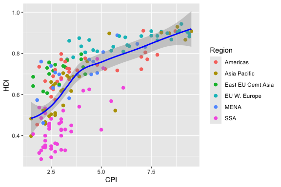

</div>

:::

#### 1.7 Fit a separate straight line for each region instead, and turn off the confidence interval.

``` r

::: {.cell}

```{.r .cell-code}
library(ggplot2)

ggplot(economist_data, aes(x = CPI, y = HDI, color = Region)) +
  geom_point(size = 2) +
  geom_smooth(method = "lm", se = FALSE) +
  labs(
    x = "CPI",
    y = "HDI"
  ) +
  theme_gray()
```

<div class="cell-output cell-output-stderr">

    `geom_smooth()` using formula = 'y ~ x'

</div>

<div class="cell-output-display">

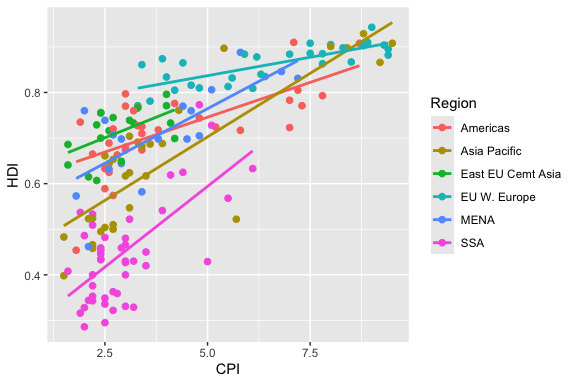

</div>

:::

#### 1.8 Building on top of the previous plot, show each Region in a different facet.

``` r

::: {.cell}

```{.r .cell-code}
library(ggplot2)


ggplot(economist_data, aes(x = CPI, y = HDI, color = Region)) +
  geom_point(size = 2) +
  geom_smooth(method = "lm", se = FALSE) +
  labs(
    x = "CPI",
    y = "HDI"
  ) +
  theme_gray() +
  facet_wrap(~Region)
```

<div class="cell-output cell-output-stderr">

    `geom_smooth()` using formula = 'y ~ x'

</div>

<div class="cell-output-display">

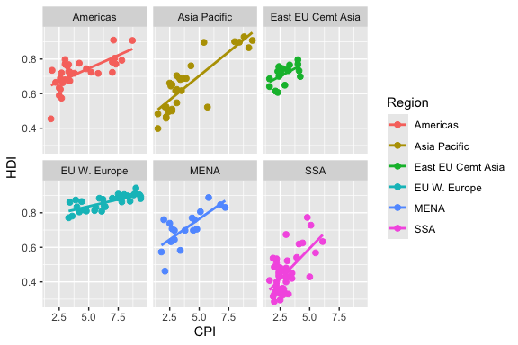

</div>

:::

#### 1.9 Show the distribution of `HDI` in each region using density plot. Set the transparency to 0.5

``` r

::: {.cell}

```{.r .cell-code}
library(ggplot2)

ggplot(economist_data, aes(x = HDI, fill = Region)) +
  geom_density(alpha = 0.5) +
  labs(
    x = "HDI",
    y = "Density",
    title = "Distribution of HDI by Region"
  ) +
  theme_gray()
```

<div class="cell-output-display">

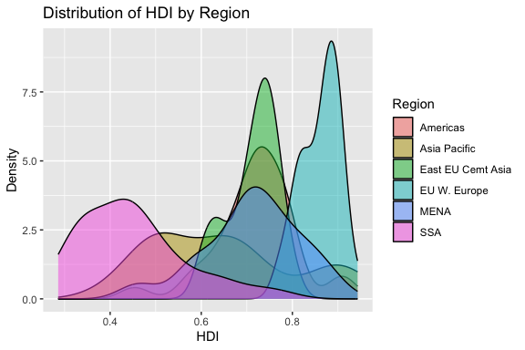

</div>

:::

#### 1.10 Show the distribution of `HDI` in each region using histogram and facetting.

``` r

::: {.cell}

```{.r .cell-code}
library(ggplot2)

ggplot(economist_data, aes(x = HDI, fill = Region)) +
  geom_histogram(alpha = 1) +
  labs(
    x = "HDI",
    y = "Count",
    title = "Distribution of HDI by Region"
  ) +
  theme_gray() +
  facet_wrap(~Region)
```

<div class="cell-output cell-output-stderr">

    `stat_bin()` using `bins = 30`. Pick better value `binwidth`.

</div>

<div class="cell-output-display">


</div>

:::

#### 1.11 Show the distribution of HDI in each region using a box plot. Set the transparency of these boxes to 0.5 and do not show outlier points with the box plot. Instead, show all data points for each country in the same plot. (Hint: `geom_jitter()` or `position_jitter()` might be useful.)

``` r

::: {.cell}

```{.r .cell-code}
library(ggplot2)

ggplot(economist_data, aes(x = HDI, fill = Region)) +
  geom_histogram(alpha = 1) +
  labs(
    x = "HDI",
    y = "Count",
    title = "Distribution of HDI by Region"
  ) +
  theme_gray() +
  facet_wrap(~Region)
```

<div class="cell-output cell-output-stderr">

    `stat_bin()` using `bins = 30`. Pick better value `binwidth`.

</div>

<div class="cell-output-display">

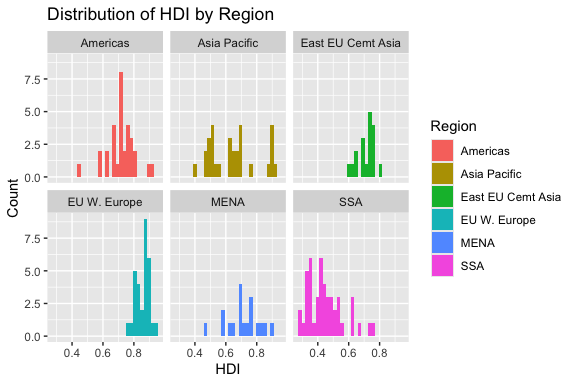

</div>

``` r
library(ggplot2)

ggplot(economist_data, aes(x = Region, y = HDI, fill = Region, color = Region)) +
  geom_boxplot(alpha = 0.5, outlier.shape = NA) +   # semi-transparent boxes
  geom_jitter(width = 0.2, alpha = 0.7, size = 1.5) + # points colored by region
  labs(
    x = "Region",
    y = "HDI",
    title = "Distribution of HDI by Region"
  ) +
  theme_gray()
```

<div class="cell-output-display">

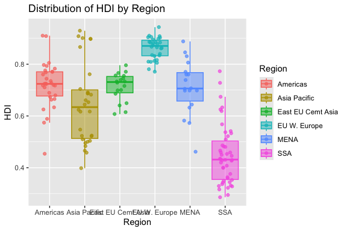

</div>

:::

#### 1.12 Show the count of countries in each region using a bar plot.

``` r

::: {.cell}

```{.r .cell-code}
library(ggplot2)

ggplot(economist_data, aes(x = HDI, fill = Region)) +
  geom_histogram(alpha = 1) +
  labs(
    x = "HDI",
    y = "Count",
    title = "Distribution of HDI by Region"
  ) +
  theme_gray() +
  facet_wrap(~Region)
```

<div class="cell-output cell-output-stderr">

    `stat_bin()` using `bins = 30`. Pick better value `binwidth`.

</div>

<div class="cell-output-display">


</div>

``` r
ggplot(economist_data, aes(x = Region)) +
  geom_bar() +
  labs(
    x = "Region",
    y = "Number of Countries",
    title = "Count of Countries per Region"
  ) +
  theme_gray()
```

<div class="cell-output-display">

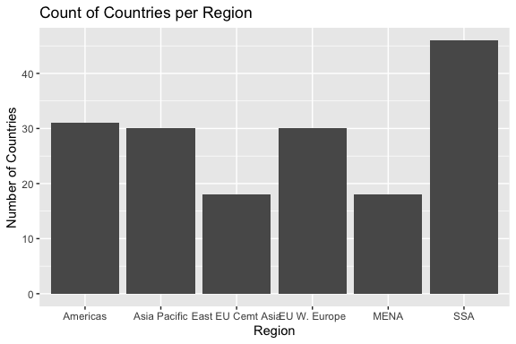

</div>

:::

#### 1.13 You have now created a variety of different plots of the same dataset. Which of your plots do you think are the most informative? Describe briefly the major trends that you see in the data.

Answer: While I think all of them convey important information, just
under the metric of most information extracted from the plot I would say
that (1.5) (with HDI/CPI correlation, region color-coding, and rank by
size) provides the most information on separate parameters, while (1.6)
and (1.8) seem particularly useful on a data analysis context as they
show data trends by region. Those plots that show uncertainty, such as
(1.1), are also particularly useful. We see that in general, the EU
WEurope data is scattered at high HDI/CPI, a trend that holds across
different data representations.

<br>

## Exercise 2. Theophylline experiment

This exercise uses the `Theoph` data frame (comes with your R
installation), which has 132 rows and 5 columns of data from an
experiment on the pharmacokinetics of the anti-asthmatic drug
theophylline. Twelve subjects were given oral doses of theophylline then
serum concentrations were measured at 11 time points over the next 25
hours. You can learn more about this dataset by running `?Theoph`

Have a look at the data structure

``` r

```{.r .cell-code}
?Theoph
head(Theoph) %>% kable()
```

| Subject |   Wt | Dose | Time |  conc |
|:--------|-----:|-----:|-----:|------:|
| 1       | 79.6 | 4.02 | 0.00 |  0.74 |
| 1       | 79.6 | 4.02 | 0.25 |  2.84 |
| 1       | 79.6 | 4.02 | 0.57 |  6.57 |
| 1       | 79.6 | 4.02 | 1.12 | 10.50 |
| 1       | 79.6 | 4.02 | 2.02 |  9.66 |
| 1       | 79.6 | 4.02 | 3.82 |  8.58 |

For the following exercise, **transform the data as instructed**. Try to
use tidyverse functions even if you are more comfortable with base-R
solutions. Show the **first 6 lines** of the transformed data in a table
through RMarkdown **using the kable() function**, as shown above.

#### 2.1 Select columns that contain a lower case “t” in the `Theoph` dataset. Do not manually list all the columns to include.

``` r

```{.r .cell-code}
theoph_t <- Theoph %>%
  select(contains("t"))

head(theoph_t) %>% kable()
```

| Subject |   Wt | Time |
|:--------|-----:|-----:|
| 1       | 79.6 | 0.00 |
| 1       | 79.6 | 0.25 |
| 1       | 79.6 | 0.57 |
| 1       | 79.6 | 1.12 |
| 1       | 79.6 | 2.02 |
| 1       | 79.6 | 3.82 |

#### 2.2 Rename the `Wt` column to `Weight` and `conc` column to `Concentration` in the `Theoph` dataset.

``` r

```{.r .cell-code}
Theoph_renamed <- Theoph %>%
  rename(
    Weight = Wt,
    Concentration = conc
  )

head(Theoph_renamed) %>% kable()
```

| Subject | Weight | Dose | Time | Concentration |
|:--------|-------:|-----:|-----:|--------------:|
| 1       |   79.6 | 4.02 | 0.00 |          0.74 |
| 1       |   79.6 | 4.02 | 0.25 |          2.84 |
| 1       |   79.6 | 4.02 | 0.57 |          6.57 |
| 1       |   79.6 | 4.02 | 1.12 |         10.50 |
| 1       |   79.6 | 4.02 | 2.02 |          9.66 |
| 1       |   79.6 | 4.02 | 3.82 |          8.58 |

#### 2.3 Extract the `Dose` greater than 4.5 and `Time` greater than the mean `Time`.

``` r

```{.r .cell-code}
Theoph_filtered <- Theoph %>%
  filter(Dose > 4.5, Time > mean(Time))

head(Theoph_filtered) %>% kable()
```

| Subject |   Wt | Dose |  Time | conc |
|:--------|-----:|-----:|------:|-----:|
| 3       | 70.5 | 4.53 |  7.07 | 5.30 |
| 3       | 70.5 | 4.53 |  9.00 | 4.90 |
| 3       | 70.5 | 4.53 | 12.15 | 3.70 |
| 3       | 70.5 | 4.53 | 24.17 | 1.05 |
| 5       | 54.6 | 5.86 |  7.02 | 7.09 |
| 5       | 54.6 | 5.86 |  9.10 | 5.90 |

#### 2.4 Sort the `Theoph` dataset by `Wt` from smallest to largest and secondarily by Time from largest to smallest.

``` r

```{.r .cell-code}
Theoph_sorted <- Theoph %>%
  arrange(Wt, desc(Time))

head(Theoph_sorted) %>% kable()
```

| Subject |   Wt | Dose |  Time | conc |
|:--------|-----:|-----:|------:|-----:|
| 5       | 54.6 | 5.86 | 24.35 | 1.57 |
| 5       | 54.6 | 5.86 | 12.00 | 4.37 |
| 5       | 54.6 | 5.86 |  9.10 | 5.90 |
| 5       | 54.6 | 5.86 |  7.02 | 7.09 |
| 5       | 54.6 | 5.86 |  5.02 | 7.56 |
| 5       | 54.6 | 5.86 |  3.50 | 8.74 |

#### 2.5 Create a new column called `Quantity` that equals to `Wt` x `Dose` in the `Theoph` dataset. This will tell you the absolute quantity of drug administered to the subject (in mg). Replace the `Dose` variable with `Quantity`.

``` r

```{.r .cell-code}
Theoph_quantity <- Theoph %>%
  mutate(Quantity = Wt * Dose) %>% 
  select(-Dose) %>% 
  rename(Dose = Quantity)

head(Theoph_quantity) %>% kable()
```

| Subject |   Wt | Time |  conc |    Dose |
|:--------|-----:|-----:|------:|--------:|
| 1       | 79.6 | 0.00 |  0.74 | 319.992 |
| 1       | 79.6 | 0.25 |  2.84 | 319.992 |
| 1       | 79.6 | 0.57 |  6.57 | 319.992 |
| 1       | 79.6 | 1.12 | 10.50 | 319.992 |
| 1       | 79.6 | 2.02 |  9.66 | 319.992 |
| 1       | 79.6 | 3.82 |  8.58 | 319.992 |

#### 2.6 Find the mean conc and sum of the Dose received by each test subject.

Show data for the 6 subjects with the smallest sum of `Dose` as below.
**Do not define new intermediate objects for this exercise; use pipes to
chain together functions**.

``` r

```{.r .cell-code}
Theoph_summary <- Theoph %>%
  group_by(Subject) %>%
  summarise(
    MeanConc = mean(conc),
    TotalDose = sum(Dose)
  ) %>%
  arrange(TotalDose) %>%
  slice_head(n = 6) 

Theoph_summary %>% kable()
```

| Subject | MeanConc | TotalDose |
|:--------|---------:|----------:|
| 9       | 4.893636 |     34.10 |
| 6       | 3.525454 |     44.00 |
| 1       | 6.439091 |     44.22 |
| 2       | 4.823636 |     48.40 |
| 4       | 4.940000 |     48.40 |
| 8       | 4.271818 |     49.83 |

<br>

## Exercise 3. Unemployment in the US 1967-2015 (OPTIONAL)

This excercise uses the dataset `economics` from the ggplot2 package. It
was produced from US economic time series data available from
http://research.stlouisfed.org/fred2. It descibes the number of
unemployed persons (`unemploy`), among other variables, in the US from
1967 to 2015.

    head(economics) %>% kable()

| date       | pce   | pop    | psavert | uempmed | unemploy |
|------------|-------|--------|---------|---------|----------|
| 1967-07-01 | 506.7 | 198712 | 12.6    | 4.5     | 2944     |
| 1967-08-01 | 509.8 | 198911 | 12.6    | 4.7     | 2945     |
| 1967-09-01 | 515.6 | 199113 | 11.9    | 4.6     | 2958     |
| 1967-10-01 | 512.2 | 199311 | 12.9    | 4.9     | 3143     |
| 1967-11-01 | 517.4 | 199498 | 12.8    | 4.7     | 3066     |
| 1967-12-01 | 525.1 | 199657 | 11.8    | 4.8     | 3018     |

<br>

#### 3.1 Plot the trend in number of unemployed persons (`unemploy`) though time using the economics dataset shown above. And for this question only, hide your code and only show the plot.

``` r
## Write your code here
```

<br>

#### 3.2 Edit the plot title and axis labels of the previous plot appropriately. Make y axis start from 0. Change the background theme to what is shown below. (Hint: search for help online if needed)

``` r
## Write your code here
```
